# C110152318 徐士諭 - 軟體工程期末專題

## 內容
### 影片

### 帳號登入登出和註冊功能
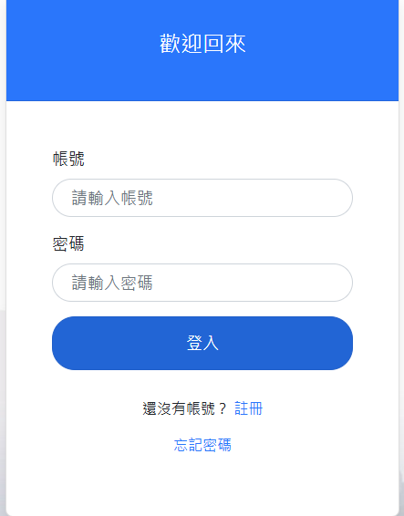
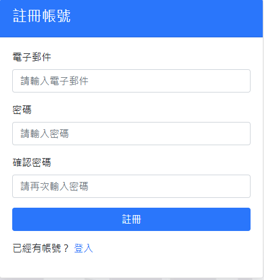
### 儲存密碼sha256、記錄帳號登入狀態
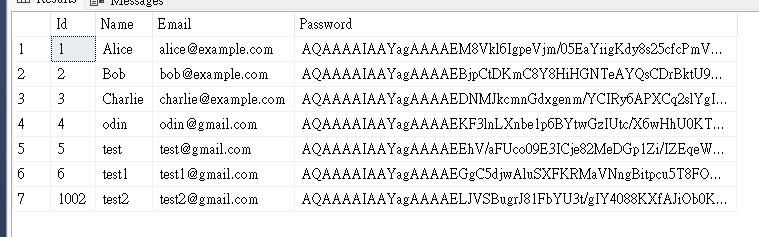
### 新增課程刪除課程、搜尋
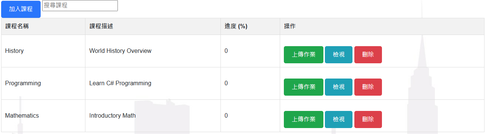
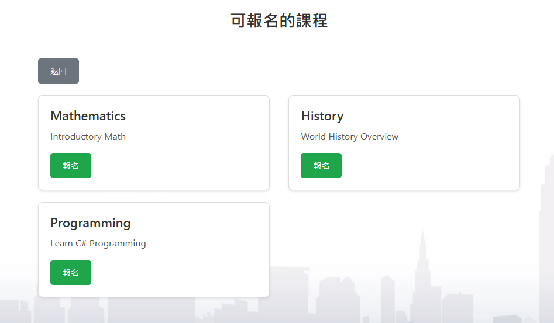
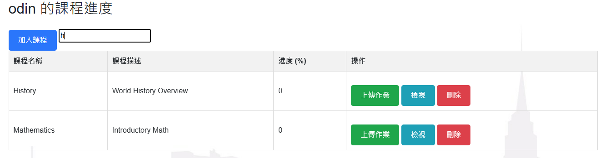
### 上傳作業、檢視上傳的作業、下載作業、上傳時間及刪除等等
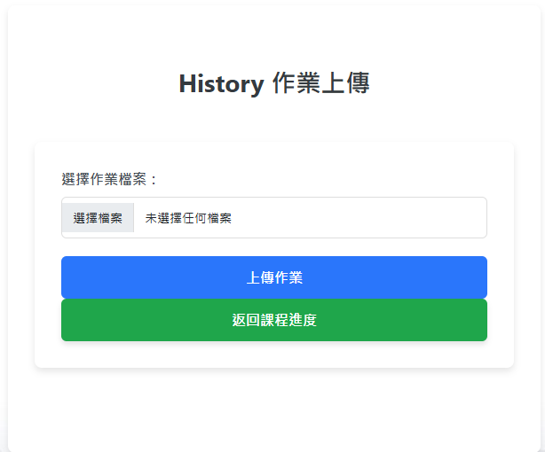
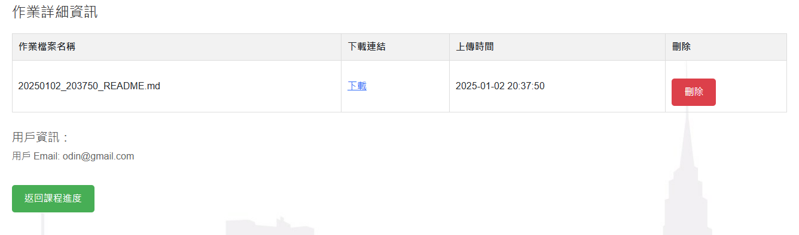
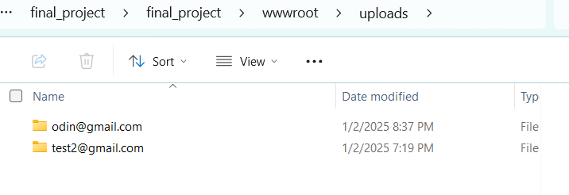
### 顯示課程資料、以選擇課程、課程描述
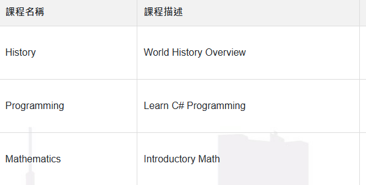
### 資料庫關聯更新刪除資料等等
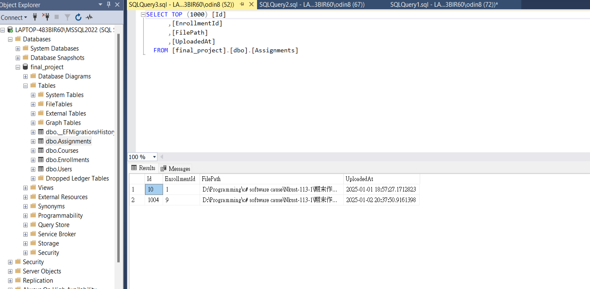
### 背景及布局設定
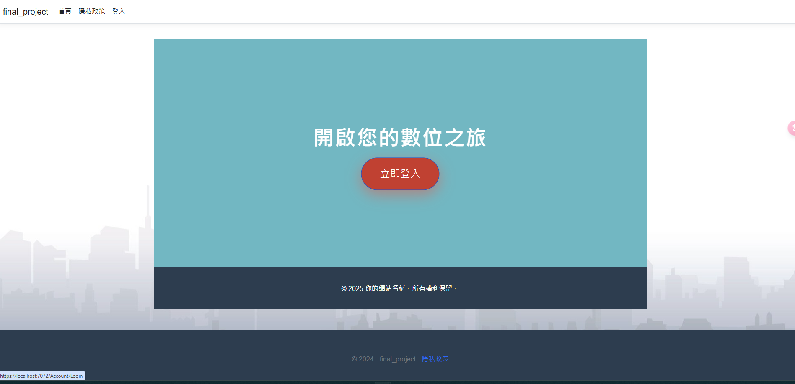

## 資料庫
- 連結資料庫
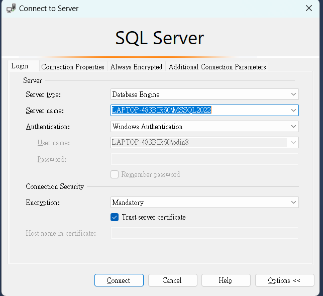
- appsettings.json改成自己的資料庫
- 刪除Migration、資料表和wwwroot/update裡面的資料
- 在Visual Studio的套件管理器主控台
    - `Add-Migration CreateMigration`
    - `Update-DataBase`

## 延伸模組
- Microsoft.EntityFrameworkCore.SqlServer
- Microsoft.EntityFrameworkCore.Tools
- Microsoft.AspNetCore.Authentication.Cookies