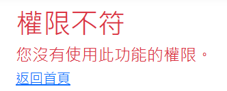

# 軟工期末作業--羊隻每日行情查詢

## 公開資料集
    市場羊隻日行情資料:
    https://data.gov.tw/dataset/17327
    提供資料包括：市場代碼、市場簡稱、市場名稱、交易日期、產品代碼、產品名稱、產品類型、數量、平均重、平均價、最高價格等欄位資料。
## 功能
- 顯示羊隻資料
    - 條列顯示(每頁顯示150筆資料)  
      

    - 圖表顯示  
      

    可以透過選取產品種類或是地區來查看價格趨勢 

     

    可以透過選取地區或日期來查看各地區羊隻種類售賣比例

      

- 排序資料  
    可以根據不同的項目對資料進行排序  
    - 日期
    - 地區
    - 商品名稱
    - 平均價格  
    

- 搜尋資料  
    可以根據不同的資料進行搜尋  
    - 地區
    - 市場名稱
    - 商品名稱
    

- 顯示全部資料  
    可以清除搜尋，顯示所有資料  
      

- 詳情資料顯示

    可以顯示該筆資料的詳細資訊  
    

- 新增、編輯與刪除功能  
      
    - 新增  
        可以新增單筆資料或是CSV檔上去  
          
          
    - 編輯  
        可以對該筆資料進行編輯    
          
          
    - 刪除  
        可以對該筆資料進行刪除    
        

         

- 帳號功能  
    - 註冊  
        可以註冊帳號    
            
        
    - 登入   
        可以登入帳號  
            
          
    - 登出  
        可以登出帳號  
          

- 權限等級
    - 訪客  
        僅能查看資料詳情以及搜尋和排序
    - Menber  
        比訪客多新增資料的權限
    - Manager  
        比Menber多編輯資料的權限
    - Admin  
        比Manager多刪除資料的權限 
     
         
    
    權限等級不符合時會顯示