# 景點系統 - 期末作業

## demo 影片
[期末作業Demo影片](https://www.youtube.com/watch?v=7CALIMiUhZA)

## 資料集與應用場景
選用政府公開資料平台的「景點 - 觀光資訊資料庫」作為本次期末作業資料集，實作景點系統。

## ER圖
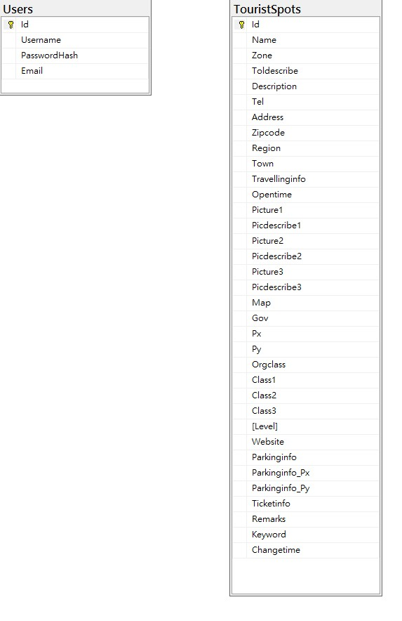

## 首頁
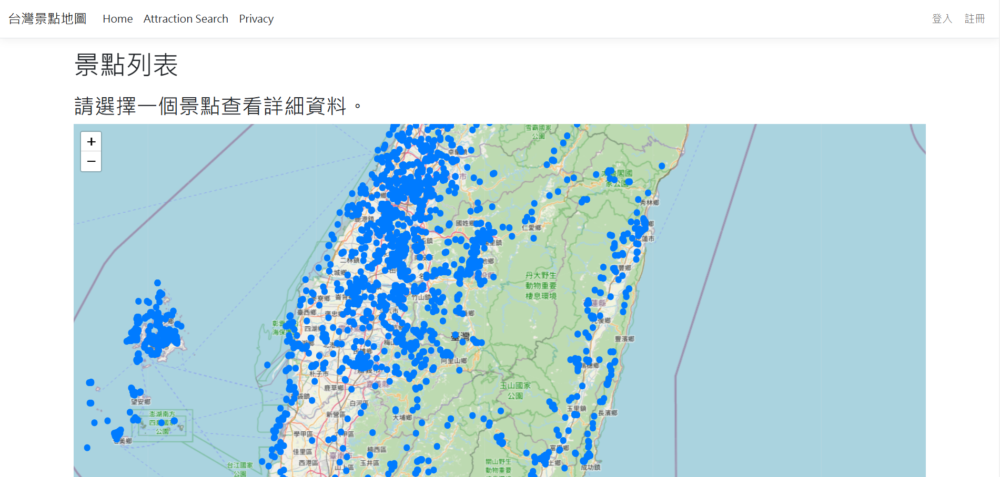

## 點取藍點，出現景點預覽
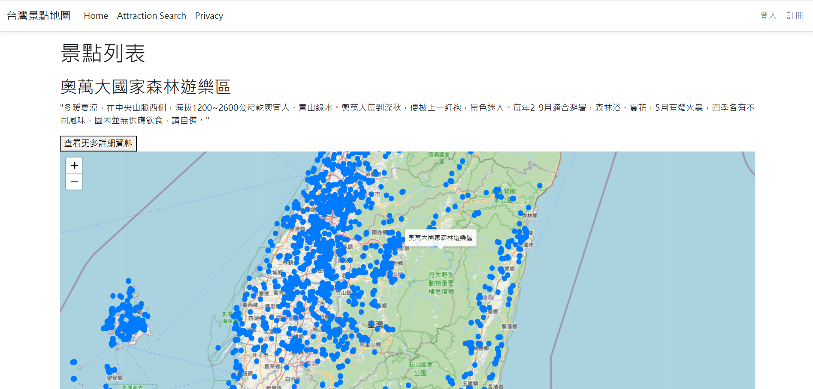
點選「查看更多詳細資料」
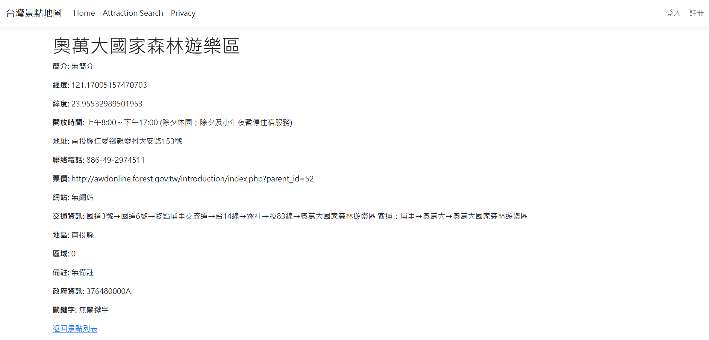
點選「返回景點列表」回到首頁

## 「Attraction Search」可搜尋景點
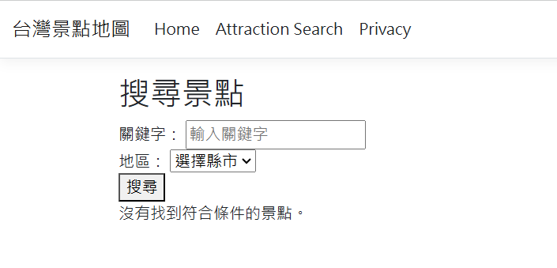
關鍵字搜尋
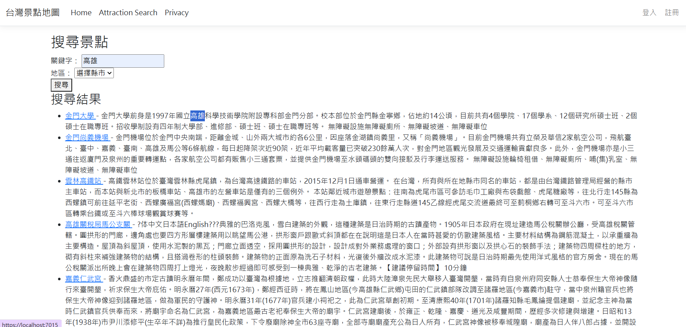
地區關鍵字搜尋
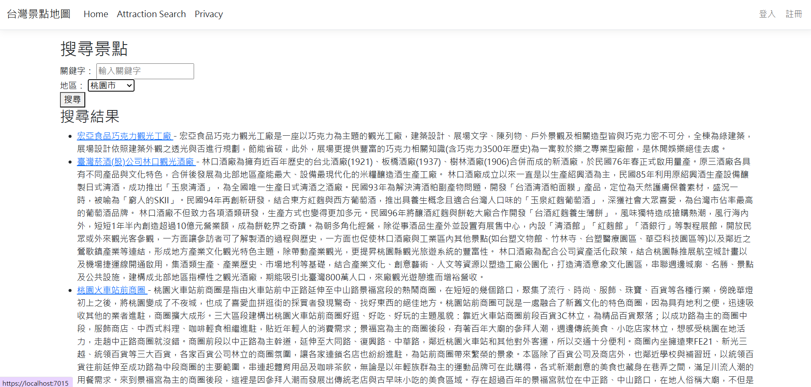

## 註冊介面

## 登入介面
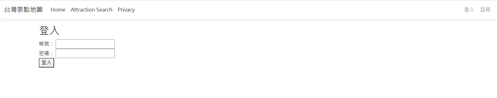
登入後回到首頁右上角會顯示歡迎
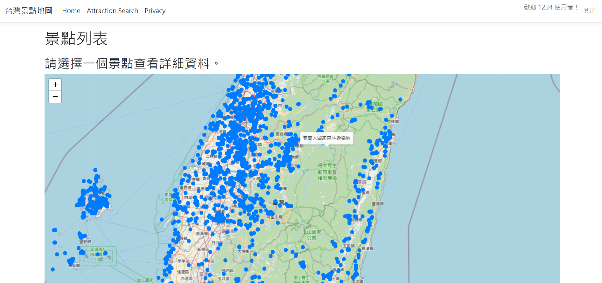

## 登入後，再次點取藍點介面多出「管理景點」的選項
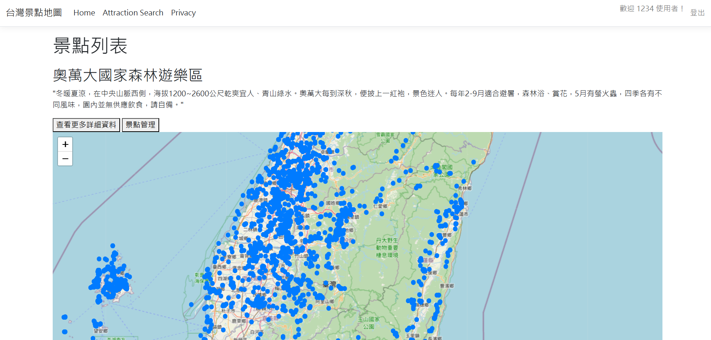
選取「管理景點」後可修改內容
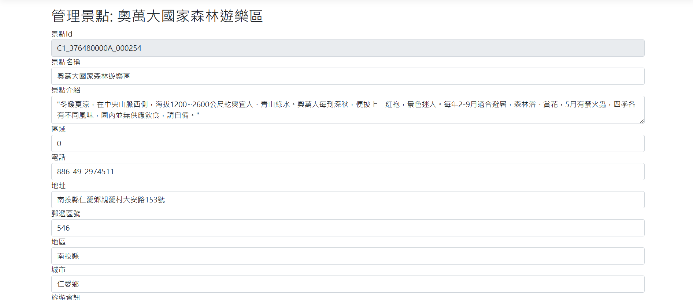
例如標題
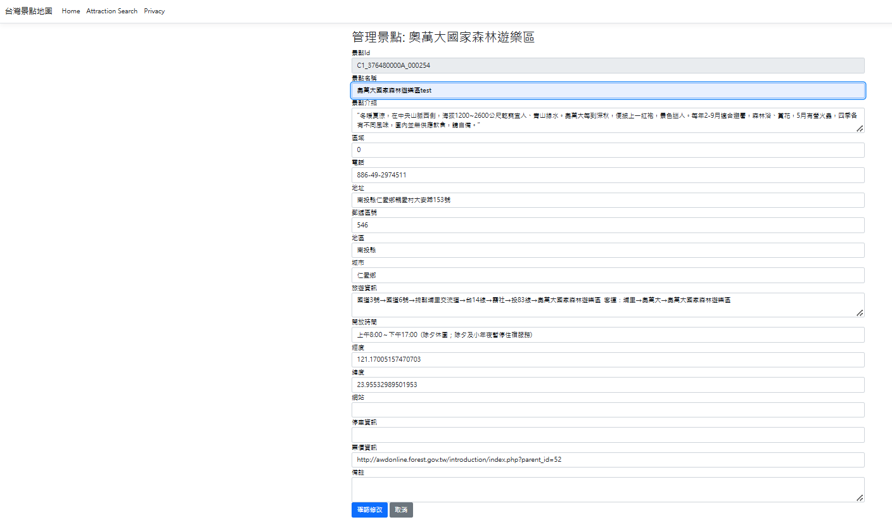
最後點確認修改
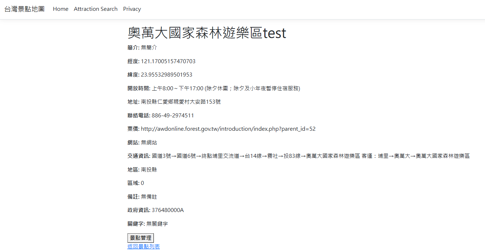
標題變更成功

## 資料來源
[景點 - 觀光資訊資料庫](https://data.gov.tw/dataset/7777)

