# 犯罪資料庫
簡單的犯罪資料庫，可以查詢、篩選、排序、新增、修改、刪除資料，用戶功能：註冊、登入/登出，權限控制，資料的視覺化。

# Table of Contents
- [犯罪資料庫](#犯罪資料庫)
- [Table of Contents](#table-of-contents)
  - [1. 資料集選擇](#1-資料集選擇)
    - [1.1 資料集](#11-資料集)
    - [1.2 資料集內容](#12-資料集內容)
    - [1.3 資料集範例](#13-資料集範例)
  - [2. 資料的查詢、篩選與排序](#2-資料的查詢篩選與排序)
    - [2.1 查詢](#21-查詢)
    - [2.2 排序](#22-排序)
  - [3. 資料的新增、修改與刪除（CRUD）](#3-資料的新增修改與刪除crud)
    - [3.1 新增](#31-新增)
      - [3.1.1 新增單筆資料](#311-新增單筆資料)
      - [3.1.2 新增多筆資料](#312-新增多筆資料)
    - [3.2 修改](#32-修改)
  - [4. 用戶功能： 註冊、登入/登出。](#4-用戶功能-註冊登入登出)
    - [4.1 註冊](#41-註冊)
    - [4.2 登入](#42-登入)
    - [4.3 登出](#43-登出)
  - [5. 權限控制](#5-權限控制)
    - [5.1 三種權限](#51-三種權限)
    - [5.2 權限功能](#52-權限功能)
    - [5.3 權限展示](#53-權限展示)
  - [6. 資料的視覺化](#6-資料的視覺化)
    - [6.1 圖表](#61-圖表)
  

## 1. 資料集選擇

### 1.1 資料集
使用政府提供的[犯罪資料](https://data.gov.tw/dataset/14200)集，該資料包含以下案類的犯罪發生資訊：
- 毒品
- 強盜
- 搶奪
- 住宅盜竊
- 汽車竊盜
- 機車竊盜
- 強制性交

### 1.2 資料集內容
資料集的主要欄位包括：
- **type**：案類
- **oc_year**：發生年度
- **oc_data**：發生日期
- **oc_county**：發生縣市
- **oc_region**：發生鄉鎮市區

### 1.3 資料集範例
| type     | oc_year | oc_data | oc_county | oc_region |
| -------- | ------- | ------- | --------- | --------- |
| 住宅竊盜 | 105     | 401     | 雲林縣    | 西螺鎮    |
| 住宅竊盜 | 105     | 401     | 桃園市    | 楊梅區    |
| 住宅竊盜 | 105     | 401     | 台南市    | 新化區    |
| 住宅竊盜 | 105     | 401     | 嘉義縣    | 民雄鄉    |
| 住宅竊盜 | 105     | 401     | 桃園市    | 桃園區    |
| ...      | ...     | ...     | ...       | ...       |

---

## 2. 資料的查詢、篩選與排序
### 2.1 查詢
可以使用按按類查找。查詢后也可以使用2.2篩選功能。
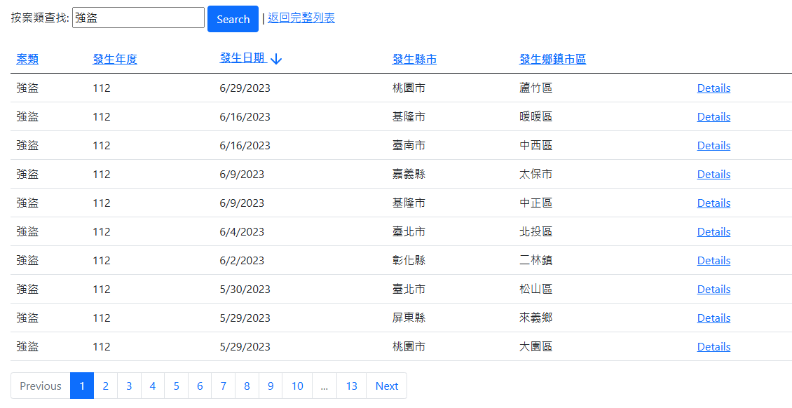
### 2.2 排序
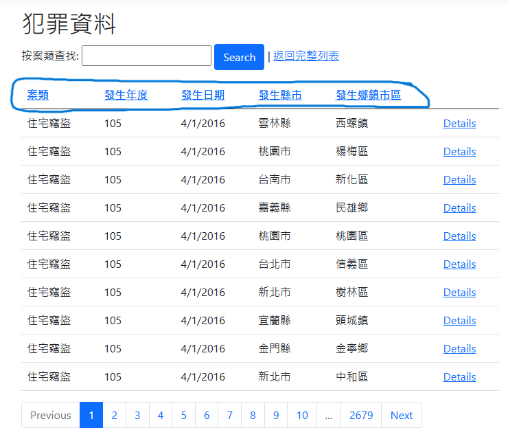  
默認是按照添加順序排序，可以選擇按照發生年度排序，也可以選擇按照發生日期排序。

儅不是按照默認時，如這張圖會顯示箭頭，向下表示降序，向上表示升序。

---

## 3. 資料的新增、修改與刪除（CRUD）
### 3.1 新增
#### 3.1.1 新增單筆資料
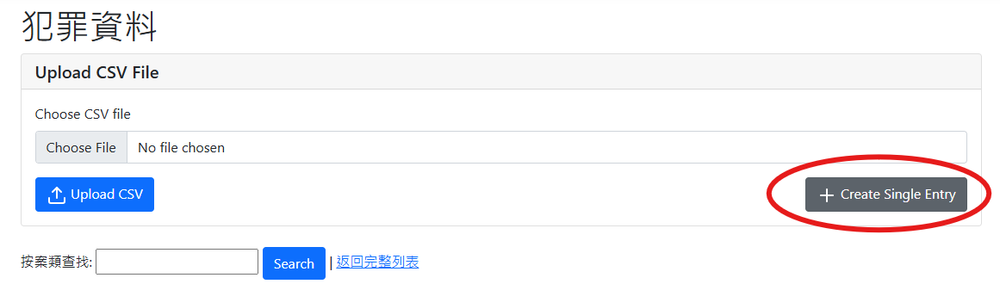  
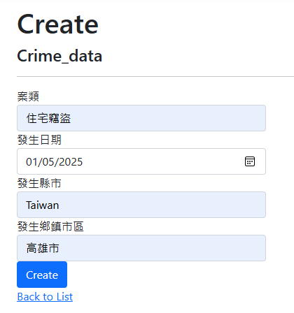  
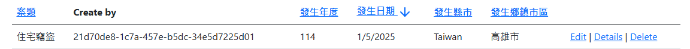
#### 3.1.2 新增多筆資料
使用CSV檔案新增多筆資料
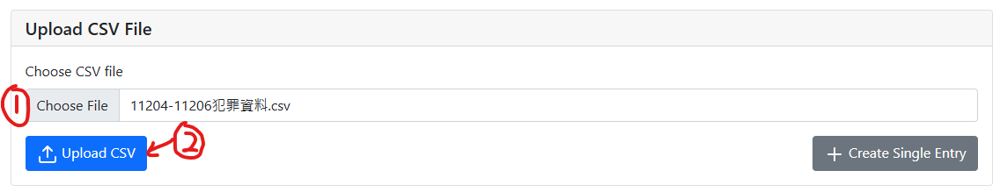  
選擇CSV檔案，然後點擊上傳按鈕，即可新增多筆資料。（如果CSV檔案很大，可能會等待一段時間）
### 3.2 修改
  
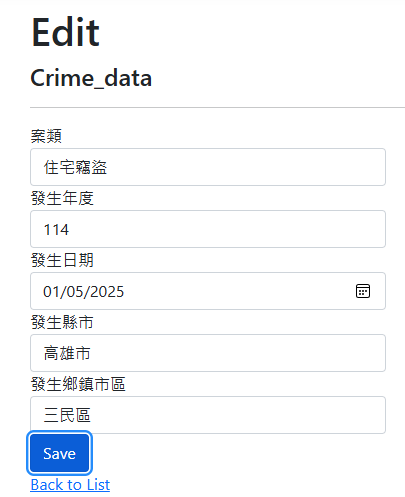
修改后點擊保存按鈕即可。
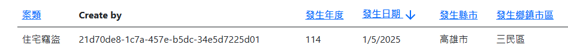  

---

## 4. 用戶功能： 註冊、登入/登出。
### 4.1 註冊
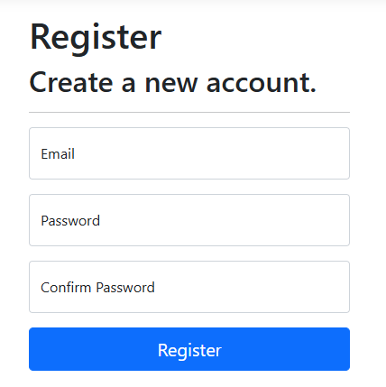  
密碼要求：
- 密碼長度至少為6個字符。
- 密碼必須至少有一個非字母數字字符。
- 密碼必須至少有一個大寫字母（'A'-'Z'）。
- 密碼必須至少有一個小寫字母（'a'-'z'）。

目前還沒設定email驗證直接點下 Click here to confirm your account. 即可註冊成功。
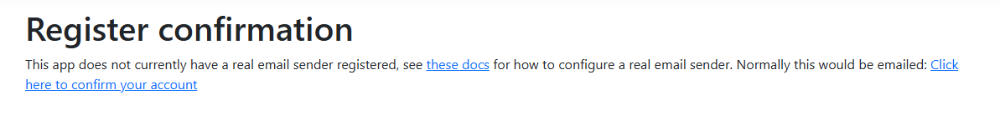  
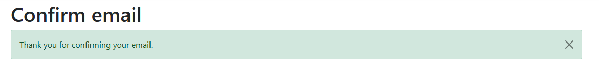  
就注冊完成了
### 4.2 登入
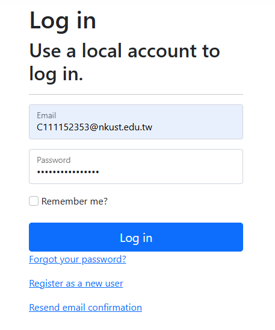  
輸入帳號密碼，點擊登入即可。

### 4.3 登出
  
點擊網頁右上角的登出按鈕即可登出。

---

## 5. 權限控制
### 5.1 三種權限
- 管理者
- 一般使用者
- 訪客
### 5.2 權限功能
- 管理者
  - 可以新增、修改、刪除所有資料
  - 可以查看所有資料
  - 可以查看是誰新增的資料
- 一般使用者
  - 可以新增、修改自己寫入的資料
  - 可以查看所有資料
- 訪客
  - 可以查看所有資料

### 5.3 權限展示
儅一般使用者修改不屬於自己的資料時，會提示權限不足。
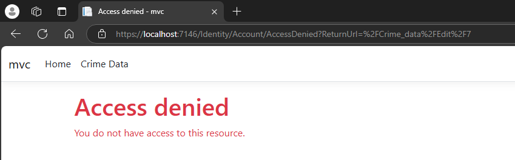  
一般使用者也不能刪除資料。（刪除按鈕會消失）
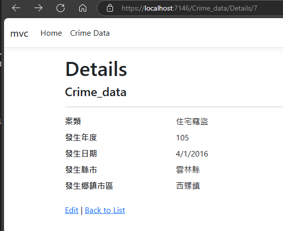  
如果手動輸入網址，刪除資料時，會提示權限不足。
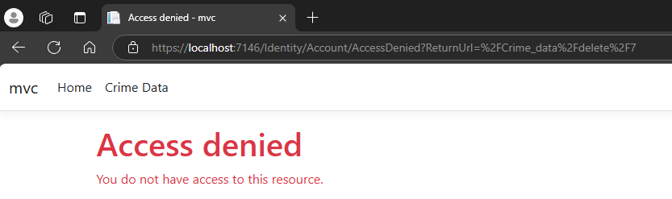

---

## 6. 資料的視覺化
### 6.1 圖表
在首頁可以看到圖表。
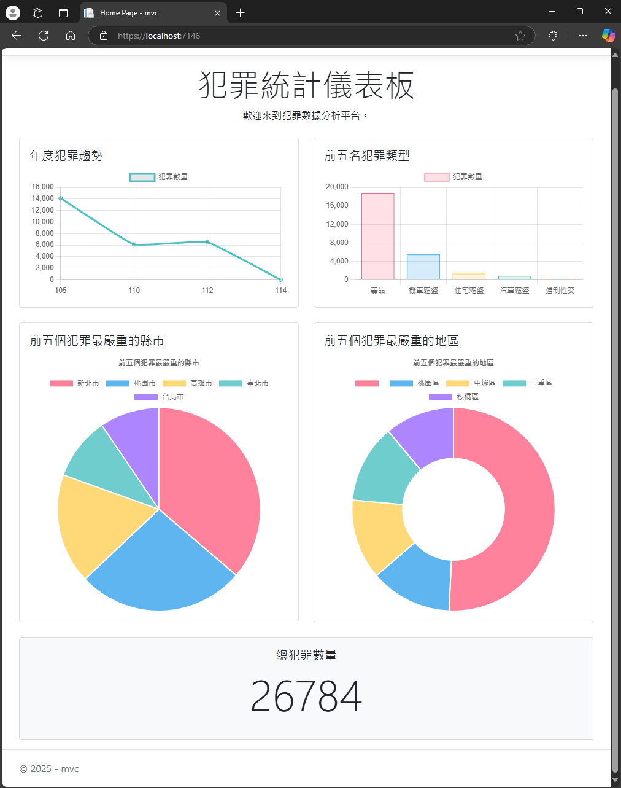  